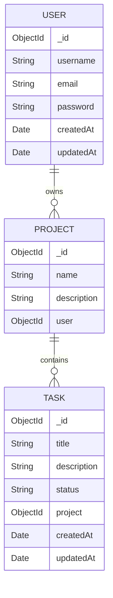

# Project and Task Management API

A REST API for user registration and login, personal project management, and task tracking. It is built with Node.js, Express, MongoDB, and Mongoose. JSON Web Tokens (JWTs) protect project and task routes.

## Features

- Register users and log in with a password hashed using bcrypt.
- Issue JWTs for authenticated requests; tokens expire after one hour.
- Create, list, retrieve, update, and delete projects.
- Create and list tasks within a project, then update or delete tasks by ID.
- Associate projects with their creator and tasks with their parent project.
- Validate model fields and record `createdAt`/`updatedAt` timestamps.

## Requirements and setup

- Node.js and npm
- A MongoDB database (local or hosted)

From this project directory, install dependencies:

```sh
npm install
```

Create a `.env` file in the project root. Set the following values:

```env
PORT=3000
MONGO_URI=mongodb://127.0.0.1:27017/project-task-api
JWT_SECRET=replace-this-with-a-long-random-secret
```

Use your actual MongoDB connection string for `MONGO_URI` and a private random value for `JWT_SECRET`. Do not commit `.env` or share the secret. Start the development server with `npm run dev`, or run it with `npm start`. The server listens on `PORT` and connects to the database configured by `MONGO_URI`.

## Authentication

`POST /api/users/register` and `POST /api/users/login` are public. A successful response includes a JWT. Include that token on every project and task request using this HTTP header:

```http
Authorization: Bearer <token>
```

The authentication middleware verifies the token with `JWT_SECRET` and attaches its decoded payload to `req.user`. A missing/malformed token, an invalid token, or an expired token returns `401 Unauthorized`. Tokens issued at registration or login expire after one hour; log in again to obtain a fresh token.

Example registration request:

```http
POST /api/users/register
Content-Type: application/json

{
  "username": "alex",
  "email": "alex@example.com",
  "password": "a-secure-password"
}
```

Example login request:

```http
POST /api/users/login
Content-Type: application/json

{
  "email": "alex@example.com",
  "password": "a-secure-password"
}
```

## API routes

All routes below `Projects` and `Tasks` require the Bearer token described above. Request and response bodies use JSON.

### Users — `/api/users`

| Method | Path | Purpose |
| --- | --- | --- |
| `POST` | `/register` | Create an account and return a token. |
| `POST` | `/login` | Verify credentials and return a token. |

### Projects — `/api/projects`

| Method | Path | Purpose |
| --- | --- | --- |
| `POST` | `/` | Create a project for the authenticated user. Send `name` and `description`. |
| `GET` | `/` | List the authenticated user's projects. |
| `GET` | `/:id` | Retrieve an owned project. |
| `PUT` | `/:id` | Update an owned project. Send the fields to update. |
| `DELETE` | `/:id` | Delete an owned project and all tasks associated with it. |
| `POST` | `/:projectId/tasks` | Create a task under a project. Send `title`, `description`, and optionally `status`. |
| `GET` | `/:projectId/tasks` | List tasks under a project. |

### Tasks — `/api/tasks`

| Method | Path | Purpose |
| --- | --- | --- |
| `PUT` | `/:taskId` | Update a task after checking that its parent project belongs to the authenticated user. |
| `DELETE` | `/:taskId` | Delete a task after checking that its parent project belongs to the authenticated user. |

Valid task statuses are `To Do`, `In Progress`, and `Done`. The task ID is the MongoDB ObjectId returned when creating the task. There is no standalone task retrieval route in the current API.

Example project creation body:

```json
{
  "name": "Website Redesign",
  "description": "Build a new landing page and improve the user experience."
}
```

Example task creation body:

```json
{
  "title": "Create homepage wireframe",
  "description": "Sketch the layout and hero section.",
  "status": "To Do"
}
```

When updating a task, send the task fields to change, for example `{"status":"In Progress"}`. Use the exact status values listed above.

## Authorization and ownership

Authentication and authorization are different checks. The JWT middleware proves that a request has a valid signed-in user; ownership checks decide whether that user may access a particular record.

- A project stores its owner's user ID in `Project.user`. Project retrieval, update, and deletion match both the project ID and `req.user._id`.
- A task stores its parent project's ID in `Task.project`. Task creation and listing first find the project using both its ID and `req.user._id`; task update and deletion look up the parent project and make the same owner check.
- The task's `project` property is an ObjectId unless the query explicitly populates it. Use `task.project` directly in a project query in the non-populated case; use `task.project._id` only when populated.

Requests for projects or tasks the authenticated user does not own return 404, avoiding disclosure of another user's records. Deleting an owned project removes its associated tasks as well.

## Data model



- **User:** required, unique, trimmed username; required, unique email with basic format validation; required password with a minimum length of eight characters. Passwords are hashed before saving. Timestamps are enabled.
- **Project:** required `name` and `description`, plus a required ObjectId reference to its owning user.
- **Task:** required `title` and `description`, optional `status` constrained to the supported values, and a required ObjectId reference to its project. Timestamps are enabled.

The relationships form a one-to-many hierarchy: one user can own many projects, and one project can contain many tasks. Task ownership is derived through the parent project rather than a direct user field.

## Common responses and troubleshooting

- **401 Unauthorized:** Check that the route is protected (all project/task routes are), that the header is exactly `Authorization: Bearer <token>`, and that the token has not expired. A task ID or project ID is not an authentication token.
- **404 Not Found:** The requested record may not exist. For project and task mutations, a 404 can also indicate that the authenticated user does not own the record; this avoids revealing another user's data.
- **500 Internal Server Error:** The current controllers return 500 for caught database and other errors. Check the server output and verify MongoDB connectivity, request JSON, and ObjectId formats.
- If MongoDB does not connect, confirm `MONGO_URI` is present and valid. If tokens fail verification, confirm the running server uses the same `JWT_SECRET` value that it used when issuing the token.

## Project structure

```text
config/connection.js       MongoDB connection
controller/                Request handlers for users, projects, and tasks
models/                     Mongoose schemas and models
routes/api/                 Express API route definitions
verifyAuthentication.js    JWT verification middleware
server.js                   Express app setup and server startup
```

## Scripts

- `npm run dev` — start the server with nodemon for development.
- `npm start` — start the server with Node.js.
