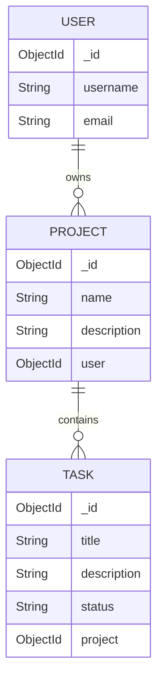

# TaskItEasy — Project & Task Management Application

A full-stack project and task management application built with React, TypeScript, Tailwind CSS, Node.js, Express, and MongoDB. TaskItEasy allows users to authenticate, organize projects, and manage tasks through a web-based interface.

## Table of Contents

* [1. Project Overview](#1-project-overview)
* [2. Technology Stack](#2-technology-stack)
* [3. Project Structure](#3-project-structure)
* [4. Features and Functionality](#4-features-and-functionality)
* [5. Application Architecture](#5-application-architecture)
* [6. Getting Started](#6-getting-started)
* [7. Environment Variables](#7-environment-variables)
* [8. API Integration and Authentication](#8-api-integration-and-authentication)
* [9. Important Implementation Learnings](#9-important-implementation-learnings)
* [10. Challenges, Errors, and Troubleshooting](#10-challenges-errors-and-troubleshooting)
* [11. Deployment](#11-deployment)
* [12. Git and Version Control Learnings](#12-git-and-version-control-learnings)
* [13. Future Improvements](#13-future-improvements)
* [14. Final Takeaways](#14-final-takeaways)

---

## 1. Project Overview

TaskItEasy is a full-stack web application designed to help users manage projects and their associated tasks in one place.

The application separates the frontend and backend into two independent applications:

* **Frontend:** A responsive React application built with TypeScript and Tailwind CSS.
* **Backend:** A REST API built with Node.js and Express.
* **Database:** MongoDB, accessed through Mongoose.
* **Authentication:** JSON Web Tokens (JWT), used to authenticate protected API requests.

The project provided practical experience in developing a full-stack application, connecting frontend components to backend endpoints, implementing CRUD operations, managing authentication, handling asynchronous requests, and preparing the application for deployment.

## 2. Technology Stack

| Technology      | Purpose                                                   |
| --------------- | --------------------------------------------------------- |
| React           | Building reusable, component-based user interfaces        |
| TypeScript      | Adding static type checking to frontend code              |
| Vite            | Frontend development server and production build tooling  |
| Tailwind CSS    | Responsive styling and utility-based layouts              |
| React Router    | Navigation between application pages                      |
| Axios           | Sending HTTP requests to the backend                      |
| Lucide React    | Icons for buttons, navigation, and task status indicators |
| Node.js         | JavaScript runtime for the backend                        |
| Express.js      | Defining REST API routes and middleware                   |
| MongoDB         | Persistent storage for application data                   |
| Mongoose        | Modeling documents and interacting with MongoDB           |
| JSON Web Tokens | Authentication for protected API routes                   |
| dotenv          | Loading configuration from environment variables          |
| Render          | Hosting the backend service                               |


## 3. Project Structure

The repository was organized to keep the frontend and backend separate.

```text
TaskItEasy/
├── README.md
├── TaskAppFrontend/
│   ├── src/
│   │   ├── pages/
│   │   │   ├── DashBoardPage.tsx
│   │   │   ├── ProjectsPage.tsx
│   │   │   ├── ProjectDetailPage.tsx
│   │   │   ├── CreateTaskPage.tsx
│   │   │   └── TasksPage.tsx
│   │   ├── index.css
│   │   └── ...
│   ├── package.json
│   └── .env                  Local API URL (create this file)
└── TaskAppBackend/
    ├── config/
    │   └── connection.js
    ├── controller/
    │   ├── projectController.js
    │   ├── tasksController.js
    │   └── userController.js
    ├── models/
    │   ├── Project.js
    │   ├── Task.js
    │   └── User.js
    ├── routes/
    ├── server.js
    ├── verifyAuthentication.js
    ├── package.json
    └── ...
```

### Responsibilities of the main folders

* `pages/`: React pages for the dashboard, projects, project details, task creation, and task listing.
* `config/`: Database connection configuration.
* `controller/`: Business logic for user, project, and task operations.
* `models/`: Mongoose schemas and database models.
* `routes/`: Express endpoints that connect incoming requests to controller functions.
* `server.js`: Backend entry point, application setup, middleware, and route registration.
* `verifyAuthentication.js`: Authentication middleware for protected endpoints.

Separating routes, controllers, and models makes the application easier to understand, maintain, and debug.

## 4. Features and Functionality

### 4.1 User authentication

The application includes user authentication and uses JWTs to protect relevant backend operations.

The frontend retrieves the token from browser `localStorage` using the key `token` and sends it in the HTTP Authorization header:

```typescript
const token = localStorage.getItem('token');
```

Protected requests follow this pattern:

```typescript
headers: {
  Authorization: `Bearer ${token}`
}
```

The backend verifies the token before allowing access to protected functionality.

### 4.2 Project management

The project functionality supports the CRUD lifecycle:

* **Create:** Create a project.
* **Read:** Retrieve projects and view individual project details.
* **Update:** Edit project information, including its name and description.
* **Delete:** Delete a project.

The project detail page retrieves a project using its identifier:

```typescript
axios.get(`${API_URL}/api/projects/${projectId}`, {
  headers: {
    Authorization: `Bearer ${token}`
  }
});
```

This demonstrated how route parameters from React Router can be used to retrieve specific resources from a REST API.

### 4.3 Task management

Tasks are associated with projects and can be managed from the project detail page.

The task functionality includes:

* Creating tasks within a project.
* Retrieving tasks associated with a particular project.
* Updating task titles, descriptions, and statuses.
* Deleting tasks.
* Displaying tasks and their current statuses.

The statuses used during development are:

* `To Do`
* `In Progress`
* `Done`

A task has fields including `_id`, `title`, `description`, `status`, and `project`, based on the frontend interface implemented for project details.

The project-specific task request follows this pattern:

```typescript
axios.get(`${API_URL}/api/projects/${projectId}/tasks`, {
  headers: {
    Authorization: `Bearer ${token}`
  }
});
```

Task updates and deletions use the task identifier, following the existing `/api/tasks/:taskId` route pattern.

### 4.4 Dashboard

The dashboard was initially built with static sample data to establish the layout and visual structure.

It includes:

* A greeting and introductory message.
* Active-project and in-progress-task statistics.
* A task overview called “Today's Focus.”
* A project overview called “Your Projects.”

The initial values and example projects were hardcoded. Replacing those values with actual API data is an important next step for making the dashboard reflect the user's real projects and tasks.

### 4.5 User interface and styling

Tailwind CSS was used to build the interface using utility classes.

The styling includes:

* Responsive grid layouts.
* Cards with borders and rounded corners.
* Consistent spacing and typography.
* Status indicators.
* Hover states.
* Icons from Lucide React.

Shared design tokens were also used, including classes such as `text-heading`, `text-muted`, `bg-surface`, `border-border`, `text-primary`, and `text-accent`.

These tokens help maintain visual consistency across different pages.

---

## 5. Application Architecture

TaskItEasy follows a client-server architecture.

```text
User
  |
  v
React + TypeScript Frontend
  |
  | Axios HTTP requests
  | Authorization: Bearer <JWT>
  v
Express REST API
  |
  v
Authentication Middleware
  |
  v
Routes and Controllers
  |
  v
Mongoose Models
  |
  v
MongoDB
```

The frontend is responsible for presenting information and collecting user input. The backend handles API requests, authentication checks, and database operations. MongoDB stores the application's persistent data.

This separation means that the frontend does not directly access the database.

### Example request lifecycle

When a user opens a project:

1. React Router provides the project identifier through the URL.
2. The component reads the identifier using `useParams()`.
3. Axios sends a request to the corresponding backend endpoint.
4. The request includes the JWT when authentication is required.
5. Express routes the request to the appropriate controller.
6. The controller retrieves the project from MongoDB.
7. The API returns the response.
8. React updates component state and renders the project details.

Understanding this request lifecycle was essential to connecting the frontend and backend successfully.

---

## 6. Getting Started

### Prerequisites

Install the following before running the application:

* Node.js and npm.
* Git.
* A MongoDB database, either locally or through MongoDB Atlas.
* A code editor such as Visual Studio Code.

### 6.1 Clone the repository

```bash
git clone https://github.com/AnjanSripathi/TaskItEasy.git
cd TaskItEasy
```

### 6.2 Set up the backend

```bash
cd TaskAppBackend
npm install
```

Create a `.env` file in the backend directory and configure the required environment variables.

Start the backend using the script defined in `TaskAppBackend/package.json`. For example, if the project defines a `start` script:

```sh
npm run dev
```

During development, a configured development script may be used instead.

### 2. Configure and start the frontend

In another terminal:

Open another terminal:

```bash
cd TaskAppFrontend
npm install
```

Create `TaskAppFrontend/.env`:

```env
VITE_API_URL=http://localhost:3000
```

`VITE_API_URL` is the API origin; don't add a trailing slash because page code appends paths such as `/api/projects`. Start Vite:

```sh
npm run dev
```

Open the local URL printed by Vite, normally `http://localhost:5173`.

### Frontend scripts

- `npm run dev` — run the local Vite server.
- `npm run build` — run TypeScript project checks and create a production build.

The backend package does not currently include an automated test suite; its `npm test` script is a placeholder.

## Frontend routes

`App.tsx` maps URL paths to page components. The pages under `AppLayout` share the top navigation.

| Path | Page | What it does |
| --- | --- | --- |
| `/` | Login | Sends credentials to the API and saves the returned token. |
| `/register` | Register | Creates a user account. |
| `/dashboard` | Dashboard | Shows project and task counts and a short task/project overview. |
| `/projects` | Projects | Lists the signed-in user's projects. |
| `/projects/new` | Create project | Submits a new project. |
| `/projects/:projectId` | Project details | Shows one project and its tasks; provides edit/delete actions. |
| `/projects/:projectId/tasks/new` | Create task | Adds a task to the selected project. |
| `/tasks` | Tasks | Shows tasks across the user's projects, with search and status filters. |

## How the application code fits together

### 1. Routes select a page

`src/App.tsx` uses React Router. A URL like `/projects/abc123` matches `projects/:projectId`; `ProjectDetailPage` reads `projectId` with `useParams()` and uses it to request the selected project and its tasks.

`AppLayout` displays shared navigation and an `<Outlet />`. The outlet is where React Router renders the selected child page.

### 2. Forms send API requests

Pages such as `LoginPage`, `ProjectCreatePage`, and `CreateTaskPage` keep form values in React state. For example, `useState('')` stores the current input value, and `onChange` updates it as the user types.

When the form is submitted, `preventDefault()` stops the browser from reloading the page. Axios then sends a `POST` request. After a successful response, the page may navigate to the next screen with `useNavigate()`.

### 3. Login supplies the bearer token

After a successful login, the frontend saves the JWT:

```ts
localStorage.setItem('token', response.data.token);
```

Protected requests read it and send it in the `Authorization` header:

```ts
const token = localStorage.getItem('token');

axios.get(`${API_URL}/api/projects`, {
  headers: {
    Authorization: `Bearer ${token}`
  }
});
```

The backend middleware verifies the token and puts the decoded user information on `req.user`. Missing, invalid, or expired tokens receive `401 Unauthorized`. Tokens expire after one hour; log in again if an old token is rejected.

### 4. Pages load data when they open

`useEffect()` is used for work that happens as a page loads, such as fetching projects. `useState()` holds the returned data so React can render it. A typical request chain is:

```ts
axios.get(`${API_URL}/api/projects`, { headers })
  .then(response => {
    setProjects(response.data);
  })
  .catch(error => {
    setError(error.message);
  })
  .finally(() => {
    setLoading(false);
  });
```

Axios puts the server's response body in `response.data`. The success handler saves it in state; the error handler records a message; the `finally` handler runs whether the request succeeds or fails, so the loading indicator can stop.

### 5. The dashboard gathers projects and tasks

The backend exposes a task-list endpoint for each project, rather than one endpoint for all a user's tasks. The dashboard therefore:

1. Requests the signed-in user's projects from `GET /api/projects`.
2. Requests `GET /api/projects/:projectId/tasks` for each returned project.
3. Adds the project name and ID to each task for display and navigation.
4. Counts projects and tasks in progress and renders a short list of open tasks.

`Promise.all()` waits for the task requests to finish, and `.flat()` combines their arrays into one task list. The Tasks page uses the same approach, then applies the search text and selected status filter before rendering.

### 6. Updating the screen after a change

After a successful task update, the detail page replaces that task in its `tasks` state. After deletion, it filters the deleted task out of the state array. This makes the screen update immediately without fetching the entire project again.

The backend also cascades project deletion: it deletes the project's tasks before returning success. The project detail page then navigates back to the project list.

## API endpoints used by the frontend

All project and task endpoints require `Authorization: Bearer <token>`. Registration and login are public.

| Method | Endpoint | Used for |
| --- | --- | --- |
| `POST` | `/api/users/register` | Register a user. |
| `POST` | `/api/users/login` | Log in and receive a JWT. |
| `POST` | `/api/projects` | Create a project for the signed-in user. |
| `GET` | `/api/projects` | List that user's projects. |
| `GET` | `/api/projects/:id` | Get one owned project. |
| `PUT` | `/api/projects/:id` | Update an owned project. |
| `DELETE` | `/api/projects/:id` | Delete an owned project and its tasks. |
| `POST` | `/api/projects/:projectId/tasks` | Create a task under an owned project. |
| `GET` | `/api/projects/:projectId/tasks` | List tasks for an owned project. |
| `PUT` | `/api/tasks/:taskId` | Update a task if its parent project belongs to the user. |
| `DELETE` | `/api/tasks/:taskId` | Delete a task if its parent project belongs to the user. |

Task statuses are `To Do`, `In Progress`, and `Done`. The task model requires a title and description; status is optional but, when provided, must be one of those values.

## Data relationships



Each project stores its owner's ID in `Project.user`. Each task stores its parent project's ID in `Task.project`. Task ownership is checked through that project; a task does not have a direct user field.

## Troubleshooting and lessons from development

### `401 Unauthorized`

Check that the request includes `Authorization: Bearer <token>`, that the token came from a successful login, and that it hasn't expired. A project ID or task ID is not an authentication token. To test after a token expires, log in again and use the newly saved token.

### Browser reports a CORS error

Check the API URL and make sure the frontend origin is allowed by the backend's CORS configuration. The current backend configuration permits `http://localhost:5173`; a deployed frontend origin must also be configured before a browser can call the deployed API.

### A project/task request returns 404

The ID may not exist, or the signed-in user may not own the project. The API returns 404 for inaccessible project/task records so it doesn't disclose whether another user's record exists.

### The base backend URL returns 404

The API may not define a handler for `/`. A 404 at the base URL alone doesn't prove that `/api/...` endpoints are unavailable. Test an actual API endpoint and inspect the backend logs.

### TypeScript says a state value is unused

When strict unused-variable checking is enabled, declaring `loading` or `error` state is not enough: the component must read that value, such as by displaying a loading or error message. Otherwise, remove the unnecessary state.

### Git says a push is non-fast-forward

That means the GitHub branch contains commits missing from the local branch. Fetch and inspect the history before integrating it; avoid force-pushing unless intentionally replacing remote history. If Git displays `REBASE` after a rebase has apparently completed, inspect `git status` before taking action—don't delete Git metadata while a rebase is still active.

## Current limitations and future improvements

- There is no API endpoint that returns all tasks in one request, so the dashboard and Tasks page make one task request per project.
- There are no due dates, so the dashboard's focus list means open (not `Done`) tasks, not tasks due today.
- The frontend stores JWTs in `localStorage`; production applications should evaluate token-storage risks and add a deliberate logout/refresh strategy.
- Backend CORS currently allows the local Vite origin; production deployment requires configuring the deployed frontend origin.
- Frontend forms currently log some request errors to the console; user-facing validation and clearer submission feedback would improve usability.

## Backend documentation

See [TaskAppBackend/README.md](../TaskAppBackend/README.md) for backend setup, environment variables, model details, and request handling.
